# 500MHz – 550MHz Delay-Locked Loop (DLL) Design

This repository contains the design, implementation, and characterization of a 500MHz to 550MHz Delay-Locked Loop (DLL). This project was completed as Design Project #1 for the course EE698G: Circuit design for frequency and phase synthesis by Purwansh Sahu (Roll No. 251040079). 

## Specifications and Requirements

| Parameter | Specification |
| :--- | :--- |
| **Technology** | gpdk 180nm |
| **Frequency Range** | 500 MHz (T=2.0 ns) to 550 MHz (T=1.818ns) |
| **Control Voltage (Vc) Range** | 0.4V to 1.4V |
| **Supply Voltage (Vdd)** | 1.8V (Nominal), 1.71V (Min), 1.89V (Max) |
| **Temperature Range** | 0°C to 70°C |
| **Target Static Phase Error (SPO)** | Less than 25ps |

## 1. Voltage-Controlled Delay Line (VCDL)

* **Architecture:** The VCDL is implemented as a chain of 20 current-starved inverters. 
* **Design Process:** The delay was calculated to support the target 500 MHz to 550 MHz frequency range. Transistors in each stage were optimized to ensure low-to-high and high-to-low propagation delays are approximately equal, maintaining a 50% duty cycle. 
* **Verification:** The 20-stage chain was sized to achieve the required 1.818 ns to 2.0 ns delay across Typical, Fast, and Slow process corners within the specified 0.4V to 1.4V control voltage range.

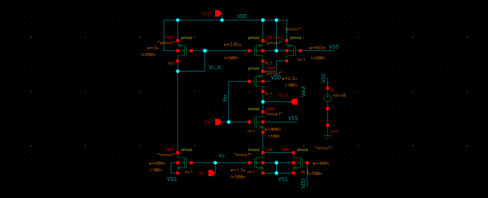
*Figure 1: Transistor level current-starved inverter schematic*

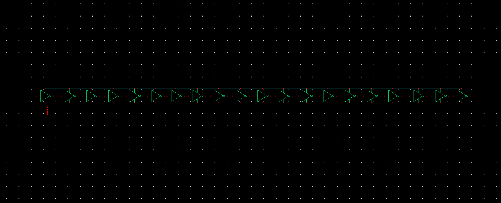
*Figure 2: Complete VCDL schematic with a 20-stage current-starved inverter chain*

### VCDL Characterization Plots

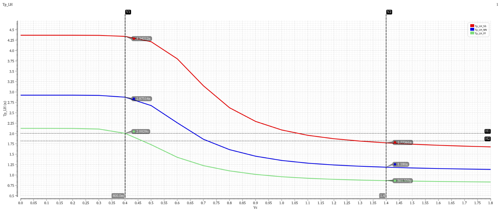
*Plot 1: tpLH vs Vc for VCDL*

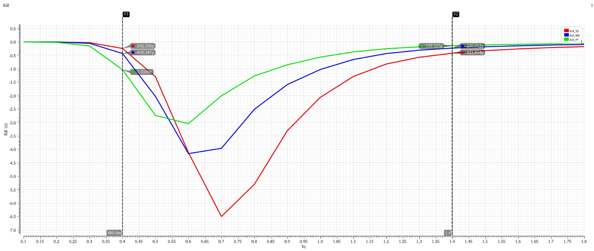
*Plot 2: Kdl vs Vc for VCDL*

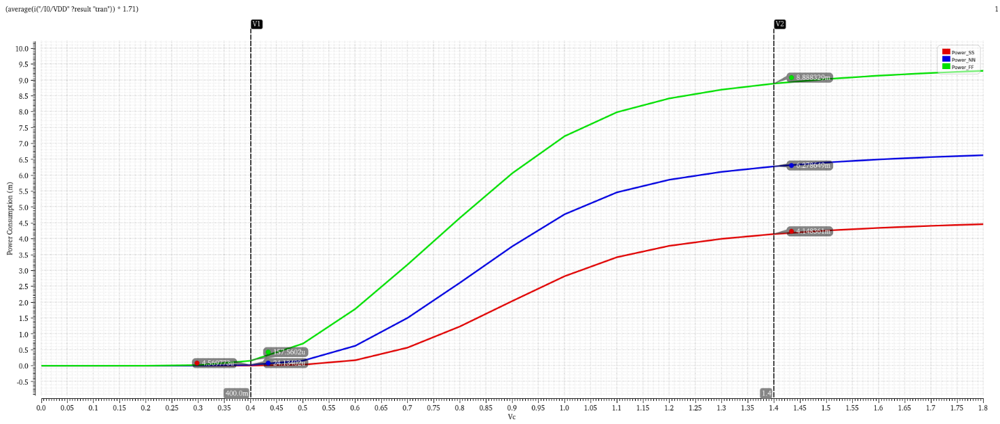
*Plot 3: Pdl vs Vc for VCDL*

## 2. Phase Frequency Detector (PFD)

* **Logic Implementation:** The PFD is constructed using two D-Flip-Flops (DFF) and an AND gate. The DFFs were implemented using Verilog-A to allow for an asynchronous reset signal.
* **Startup Stability:** An additional DFF was added to the D-input of the reference clock flip-flop to skip the first edge of the reference clock, preventing the system from locking onto unstable signals during power-up.
* **Dead Zone Elimination:** A specific delay (tdel) was tuned within the AND gate to eliminate the PFD "dead zone". This keeps the UP and DN pulses active long enough for the charge pump to respond when clocks are nearly aligned, minimizing Static Phase Offset (SPO).

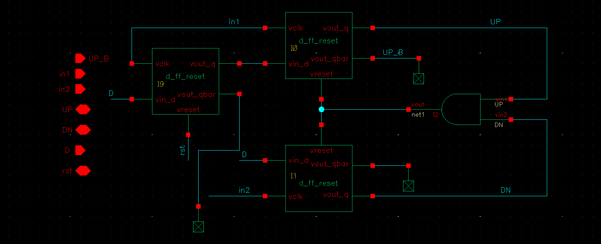
*Figure 3: Schematic of PFD using three D-Flip-Flops and an AND gate*

## 3. Charge Pump (CP) & Loop Filter

* **Topology:** A source-switched charge pump was utilized to reduce non-ideal effects like clock feedthrough and charge injection. 
* **Transistor Sizing:** The gm/ID method was used to size the transistors for a 20 µA current. ID/W values were evaluated for large channel lengths to ensure a small overdrive voltage drop and keep transistors in saturation.
* **Current Matching:** An ideal Op-Amp biases the PMOS transistors to keep the drain voltages of the NMOS and PMOS current sources equal. This improves current matching and is essential for achieving a low SPO.
* **Loop Filter:** A 10 pF capacitor integrates the charge pump current into the control voltage (Vc). A PMOS switch initializes the capacitor charge to 1.8V upon reset to speed up locking.

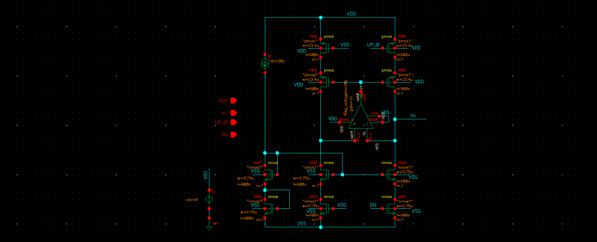
*Figure 4: Schematic of Charge Pump using a 20µA current source*

## 4. Overall DLL Performance & Results

### Calculated DLL Loop Bandwidth
*Loop filter capacitance = 10 pF*

| Condition | Fast Corner (FF) | Slow Corner (SS) |
| :--- | :--- | :--- |
| **Reference Frequency (fref)** | 500 MHz | 550 MHz |
| **VCDL Gain (Kdl)** | 985.93 ps/V | 563.00 ps/V |
| **CP Current (Icp)** | 20 µA | 20 µA |
| **Loop Bandwidth (fBW)** | 985.93 kHz | 619.30 kHz |

### Measured Static Phase Error (SPO)
The design successfully maintained an SPO well below the 25 ps target limit across all tested corners.

| Corner | Measured SPO |
| :--- | :--- |
| **Fast Corner (FF)** | 13.2975 ps |
| **Nominal (NN)** | 7.41 ps |
| **Slow Corner (SS)** | 3.65 ps |

### Power Consumption 
| Condition | Vdd | Average Current | Power |
| :--- | :--- | :--- | :--- |
| **Fast Corner (FF)** | 1.89V | 0.58 mA | 1.098 mW |
| **Nominal (NN)** | 1.8V | 1.253 mA | 2.255 mW |
| **Slow Corner (SS)** | 1.71V | 2.783 mA | 4.758 mW |

### Transient Response Plots

#### Fast (FF) Corner
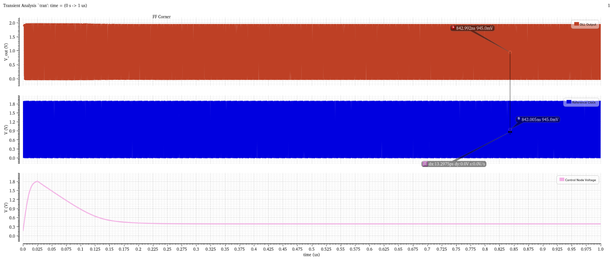
*Plot 4(a): Full transient response at Fast (FF) corner showing Vc settling around 0.4V*

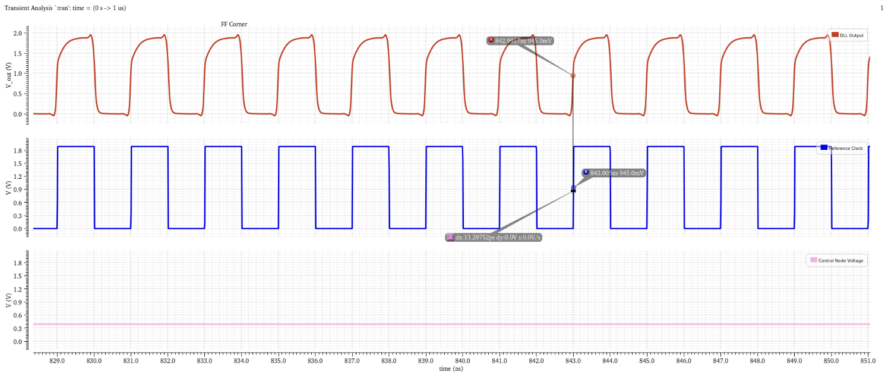
*Plot 4(b): Zoomed-in view of reference clock and DLL output at Fast (FF) corner showing 13.3 ps SPO*

#### Slow (SS) Corner
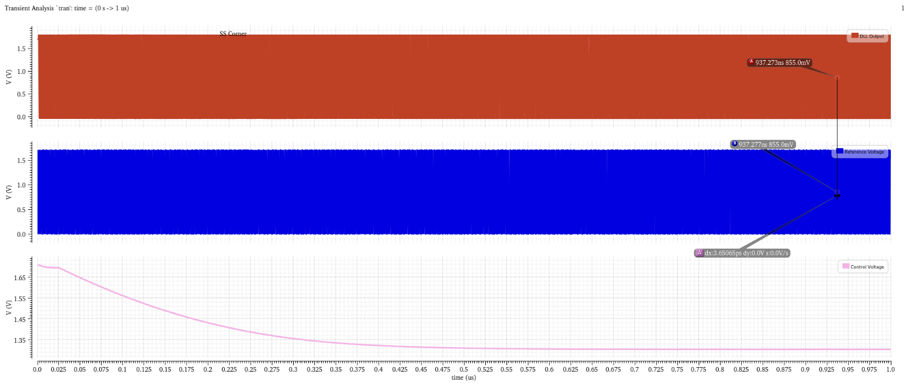
*Plot 5(a): Full transient response at Slow (SS) corner showing Vc settling around 1.305V*

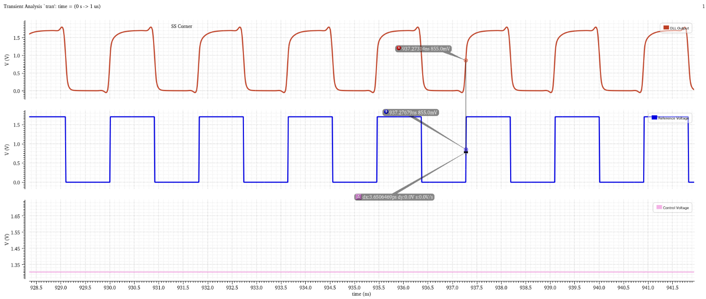
*Plot 5(b): Zoomed-in view of reference clock and DLL output at Slow (SS) corner showing 3.65 ps SPO*
